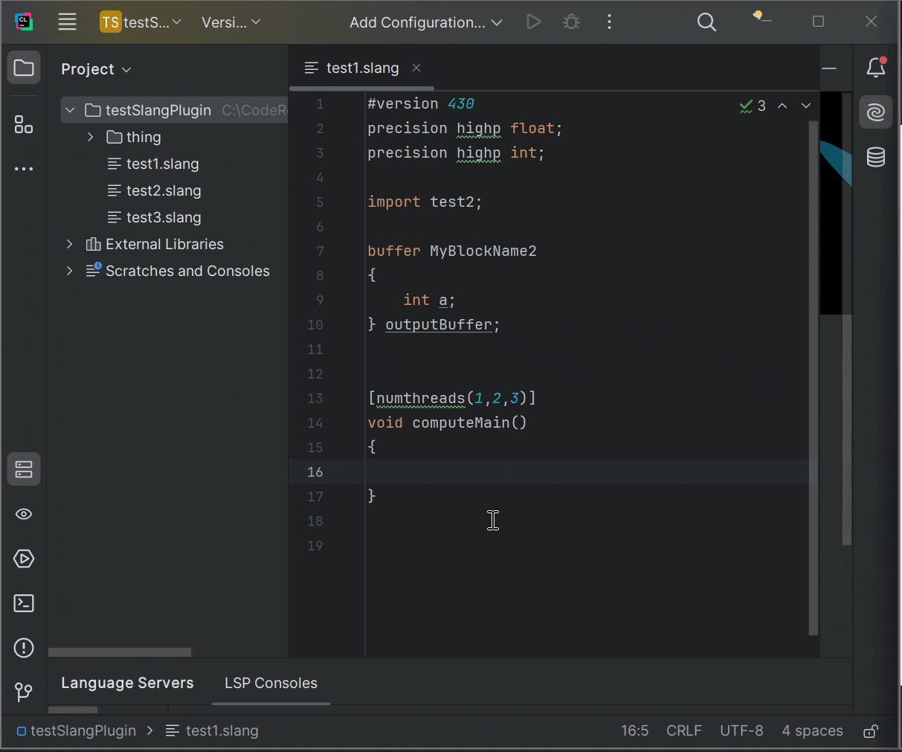

### This is an unofficial LSP for Slang to use with jetbrain IDEs.

---

### Example

---

### Jetbrains plugin distribution page
https://plugins.jetbrains.com/plugin/26239-slang-unofficial-

---

### To Build
1. install Intellij IDEA 2024.x.x
2. fetch code with `git clone --recursive https://github.com/16-Bit-Dog/slang-intellj-extenson.git`
3. build using predefined project tasks using IDEA 2024.x.x